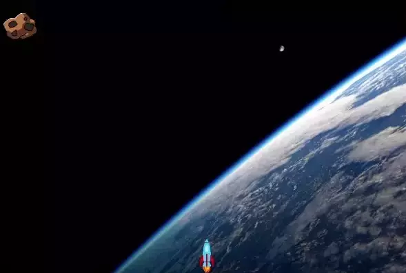
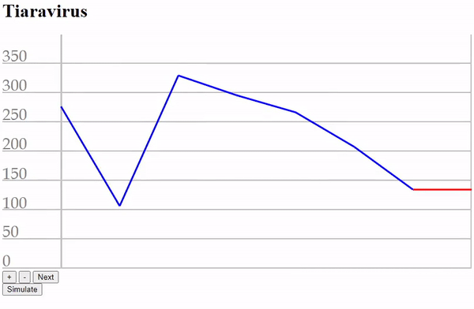

## Feladat 1: Csomagszállítás (3-csomag, 8 pont)

A csomagokat távoli helyekre repülőgéppel szállítják. A leszállás és a felszállás sok üzemanyagot fogyaszt, de egy ügyes pilóta anélkül is képes kiszállítani egy csomagot, hogy leszállna. Készíts egy játékot a vászon (canvas) segítségével, ahol az első kattintás elindítja a repülőt, a második kattintás pedig elengedi a csomagot. Mutasd meg a képességedet, és szállítsd le a házhoz!

Az index.js fájl már tartalmazza a játékhoz szükséges alapstruktúrát:

- a játékhurok (next - ahogyan az előadáson is láttuk)
- a funkciók, amelyek szükségesek a játékállapot módosításához és megjelenítéséhez (update és render)
- a szükséges objektumok a játékállapot tárolásához (plane, parcel és house)

Feladatok:

- a. (1 pont) Tisztítsd meg a vásznat a render függvényen belül, és rajzolj három téglalapot a repülőgép, a csomag (box) és a ház pozíciójára.
- b. (1 pont) Cseréld ki a téglalapokat az előre betöltött képekre.
- c. (2 pont) Amikor a felhasználó kattint, indítsd el a repülőt: állítsd be a vízszintes sebességét (balról jobbra irányú sebesség, vx, pl. 200px/s), és mozgassa a pozícióját.
- d. (1 pont) Tedd a csomagot úgy, hogy a repülővel együtt mozogjon.
- e. (1 pont) Amikor a felhasználó ismét kattint, ejtsd le a csomagot. Adj neki egy függőleges gyorsulást (ay, pl. 300 px/s^2), hogy egyre gyorsabban essen lefelé (folyamatosan növelje a lefelé irányuló sebességét). Használhatod a gameState változót a játék aktuális állapotának nyomon követéséhez.
- f. (1 pont) Ellenőrizd, hogy a csomag érinti-e a házat minden pozícióváltozáskor (képkockánként). Ha igen, jelenítsd meg a "Leszállítva" feliratot, és állítsd le a csomag esését.
- g. (1 pont) Ha a csomag eléri a vászon alját (nem érte el a házat), jelenítsd meg a "Elhibázva" feliratot a vásznon, és állítsd le a csomag esését.

## Feladat 2: Aszteroida (3-aszteroida, 8 pont)

(dramatikus zene) A Föld nagy veszélyben van! Egy hatalmas aszteroida közeledik felénk! A világ országai összefogtak, és építettek egy hatalmas rakétát, hogy az utolsó pillanatban eltalálják és megsemmisítsék az aszteroidát! Neked kell megnyomnod a gombot a megfelelő időben! A világ sorsa a te kezedben van!

- a. (1 pont) Egy `asteroid` objektum adott a kezdő csomagban. Ez az objektum tartalmazza az aszteroida koordinátáit, méretét és képét. Egy `rocket` objektum is adott, amely a rakéta koordinátáit, méretét és képét tárolja. Jelenítsd meg ezeket a vásznon.
- b. (2 pont) Adj egy új tulajdonságot az `asteroid` objektumhoz, amely a vízszintes sebességét (speed) tárolja, és állítsd be az értékét 60 px/s-ra. Adj függőleges sebességet a `rocket` objektumhoz is, és állítsd be a kezdeti értéket 0 px/s-ra. Animizáld mindkét objektumot ezek szerint a sebességek szerint időalapú animációval. A sebességek állandóak, gyorsulás/gravitáció nem szükséges. (Természetesen a rakéta még nem fog mozogni, mivel a sebessége 0-ra van rögzítve.)
- c. (2 pont) Állítsd a rakéta függőleges sebességét -200 px/s-ra, amikor bármelyik billentyűt lenyomják.
- d. (1 pont) Amikor mozgatod az aszteroidát és a rakétát, ellenőrizd, hogy ütköznek-e. Használhatod az `isCollision()` függvényt, amely mellékelve van. Ha ütköznek, írd ki a konzolra, hogy "Boom".
- e. (1 pont) Ütközés esetén állítsd le a játékhurkot, és jelenítsd meg a "Győzelem" feliratot, valamint a játékos pontszámát a vásznon. A pontszámot a mellékelt `calculateScore()` függvény adja vissza. Minél kisebb a pontszám, annál pontosabb a találat.
- f. (1 pont) Állítsd le a játékhurkot akkor is, ha a rakéta elhagyja a vásznat a felső szélénél, és jelenítsd meg a "Vesztettél" feliratot a vásznon.

## Feladat 3.: Potyogó tojások (3-falling-eggs, 8 pont)

Húsvéthétfőn a fiúk meglocsolják a lányokat, akik cserébe hímes tojást adnak. Egy lelkes locsoló felé tehát csak úgy záporoznak a tojások! Segíts neki elkapni a tojásokat!

A tojások felülről lefele esnek, a játékos egy kosarat mozgat a kurzorbillentyűkkel jobbra-balra. Ha elkap egy tojást, az plusz 1 pont; ha nem sikerül, akkor a tojás összetörik.

- a. (1 pont) Az `index.js` állományban meg van adva egy kiindulási tojás (`egg`) és kosár (`basket`) objektum. Rajzold ezeket ki a megadott koordinátákra az előre betöltött képekkel!
- b. (1 pont) A megadott tojásnak van függőleges gyorsulása és sebessége. Ezek felhasználásával kezdjen el a tojás gyorsulva leesni!
- c. (1 pont) A meglévő tojás mellett legyenek újabb tojások! Ehhez minden iterációban generálj egy véletlen számot, és ha ez kisebb, mint egy előre megadott érték, akkor adj egy tojás objektumot az `eggs` tömbhöz! A konzolra írd ki az `eggs` tömb tartalmát az új elem hozzáadása után!
- d. (2 pont) Az `eggs` tömbben lévő tojások mindegyikét mozgasd gyorsítva és rajzold is ki!
- e. (1 pont) A jobb-bal kurzorbillentyűket lenyomva a kosárnak adj vízszintes sebességet, és eszerint mozgasd is a kosarat! Ha felemeljük a billentyűt, akkor a kosár sebességét nullázzuk le!
- f. (1 pont) Ha az `eggs` tömb valamelyik tojásobjektuma ütközik a kosárral, akkor növeld a `points` változó értékét, és írd is ki! (Az ütközés detekálására megadtunk egy segédfüggvényt a kiindulási anyagban.) A tojást ekkor már ne jelenítsük meg! (Vegyük ki a tömbből, vagy egy logikai flaggel jelezzük, hogy már elkaptuk, és akkor nem kell kirajzolni.)
- g. (1 pont) Ha egy tojás eléri a rajzvászon alját, akkor törjön össze! Ehhez gyorsulását és sebességét le kell nullázni, és a `brokenEggImage` képet kell kirajzolni. Ehhez használhatjuk a tojás `broken` tulajdonságát.

## Feladat 4: Tiaravírus
A feladat elkészíteni egy új betegség, a tiaravírus előző hét napi statisztikáját megjelenítő diagramot canvas technológiával.

a. Állíts elő egy 7 hosszú tömböt 50 és 350 közötti véletlenszámokkal, ami az új fertőzöttek számát tartalmazza az előző hét napban! A tömbben tárolt értékeket írasd ki a konzolra is!
b. Jelenítsd meg a tömbben tárolt adatokat grafikusan a mintán látható módon! A rajz akkor fog a háttérre illeszkedni, ha az első szakasz kezdőpontjának x-koordinátája 100, a másodiké 200, stb. Az y-koordinátát a tömbben tárolt értékek határozzák meg, de ügyelj a koordinátarendszer állására és a háttérképen feltüntetett feliratokra!
c. A szakaszok legyenek 3 pixel vastagságúak és kék színűek!
d. Az utolsó kék szakasz végére kapcsolódjon egy piros színű szakasz, amelynek végpontja az aktuális napi fertőzöttek számát jelzi! Az aktuális napi fertőzöttek száma kezdetben megegyezik az előző nappal, a következő feladatokban teremtünk módot ennek módosítására.
e. A `+` és `-` feliratú gombokra kattintva az aktuális napi fertőzöttek száma növekedjen vagy csökkenjen 10 fővel, és a változás jelenjen meg azonnal a grafikonon!
f. A `Next` feliratú gombra kattintva a következő napra léptetjük a bevitelt, tehát a grafikon egy nappal balra tolódik.
g. A `Simulate` feliratú gombra kattintva bizonyos időközönként (pl. fél másodpercenként) automatikusan kerüljön a grafikonra egy új nap, ahol a fertőzöttek száma az előző napi érték fele. Ezzel a járvány exponenciális lecsengését szimuláljuk.

